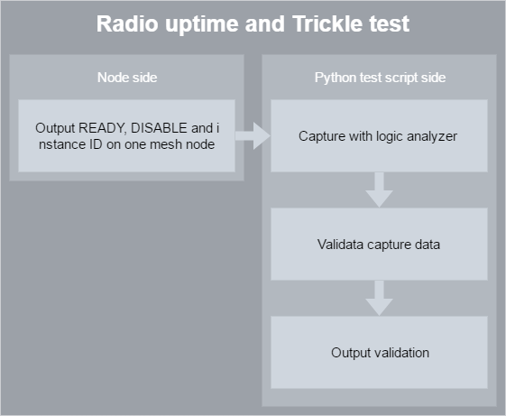
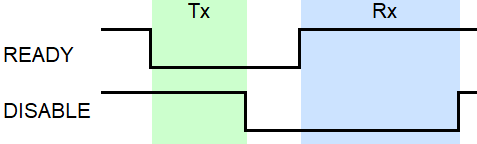
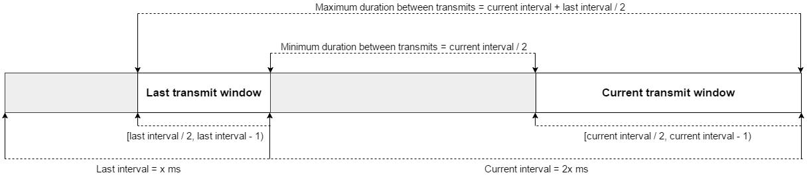

= Test scripts for the mesh implementation on PhoenixLL

Included in this repository are several tests for the radio behaviour
in a mesh of n nodes or single nodes.

The tests were used in the group project `IT2901` on a BLE mesh implementation using
`PhoenixLL` and the `Trickle algorithm`. As the product evolved, the tests had to change.
In the end, the development of one script was prioritized. This test script is descripbed below.

= Test for radio uptime and radio transmission times using the Trickle algorithm

The test for radio uptime is based on the `READY` and `DISABLED` events.
The input for the test is a `Logic Saleae` capture file from the two pins signifying the
mentioned radio events, with `READY` as LSB.

The test also reads what trickle instance a transmission is for,
keeping track of the transmission timing for each instance (maximum 16) separately and
validating the timing with respect to the Trickle algorithm.

The capture data is imported automatically by the script
if the steps listed below are followed.

== How to use the test

|===
|Logic line |Node output pin

|0
|READY event toggle

|1
|DISABLED event toggle

|2-5
|4 bits used as instance ID
|===
. Have the `Logic analyzer` lines [0-5] connected to a node in the mesh as shown in the table above.
. Have the mesh nodes running.
. Run the Python script link:../mesh_radio_test.py[`mesh_radio_test.py`]
along with the the desired capture length in seconds,
the Trickle Imin and Imax values used in the mesh code
and the amount of nodes in the mesh
`python mesh_radio_test.py [capture-seconds] [Imin] [Imax] [nodes-amount]`.

The Logic capture should begin, printing out `capturing... (x seconds)`,
followed by the results of the test.

=== Dependencies

* Logic Analyzer
* link:https://pypi.python.org/pypi/saleae[Python Saleae]
* link:https://matplotlib.org/[Python matplotlib]
* link:logicData.py[logicData] (located in the repository)

== How the test works

The script identifies the time between a
`READY` event and a `DISABLED` event as the radio being active.
The test also distinguishes between `Tx` and `Rx` by the *value* (high or low) of the pin signifying `READY`
at the time of a `DISABLED` event.

=== Radio uptime test

* If the bit for READY is `*1*`, the time from the toggle of READY to the toggle of
DISABLED is added to the total *`Rx`* time.
* If the bit for READY is `*0*`, the time from the toggle of READY to the toggle of
DISABLED is added to the total *`Tx`* time.

At the end of the test, the sum of the radio uptime is compared to the total capture time,
and a percentage for radio up time in Rx and Tx mode is printed to console.

=== Trickle transmission test

The script maintains a array for each trickle instance and appends each transmit time to the
instance array that corresponds to the instance it was transmitted in.
After all the transmission times are sorted by instance,
each of the instance arrays are passed in for testing in the function
`transmits_in_trickle(transmit_times, imin, imax)` in `logicData`.
`transmit_times` will be an array with durations since the previous transmit,
`imin` and `imax` are minimum and maximum intervals as defined by the Trickle algorithm.
This function returns an array with the indexes of the duration that failed the test.
A graphical representation of the timing of the transmissions are also returned by the script.

The allowed range of duration between two transmissions are shown in the illustration bellow.

== Issues

* A issue that was discovered with the Logic capture is that it sometimes contain some `20 ns`
durations between toggles. This has been taken into consideration in the Python script by
keeping track of the pairing of READY and DISABLED, not allowing a double toggle on the DISABLED pin to be paired with
the same READY event. This might however give a slightly larger margin of error.

* The Trickle part of the test does not have insight into the reset of the interval to Imin.
The test therefore assumes that the interval has been reset if it detects a transmission gap
`imin / 2 <= transmission_gap < imin + last_interval / 2` and adapts accordingly,
potentially missing out on detecting an error.

* If the duration between the first two transmissions is not in the Imin interval,
the Trickle validation method `transmits_in_trickle` will not pass any durations until the interval is reset to Imin.
This can be checked by looking at the array returned by the validation method,
as the first indexes from the test will have failed the test.
