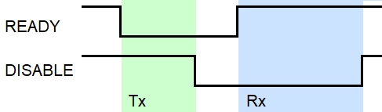

= Test for radio up time and radio transmission using the Trickle algorithm

The test for radio up time is done using the `READY` and `DISABLE` events and PPI
for toggling two separate pins.
The test input will be a `Logic Saleae` capture file from the two pins outputing the
mentioned radio events, `READY` being LSB.

The test also sorts the durations between each transmission in to instances
and validates the transmissions timing with respect to the Trickle algorithm.

The capture is imported automatically in to the script from the Logic capture
if the steps listed below are followed.

== How to use the test

|===
|Logic line |Node output pin

|0
|READY event

|1
|DISABLE event

|2
|Instance_array[0][0]

|3
|Instance_array[0][1]

|4
|Instance_array[1][0]

|5
|Instance_array[1][1]
|===
. Have the `Logic analyzer` lines [0-5] connected to a node in the mesh as shown in the table above.
. Have the mesh nodes running.
. Run the Python script link:../mesh_radio_test.py[`mesh_radio_test.py`]
along with the the desired capture length in seconds,
the Trickle Imin and Imax values uesd in the mesh code
and the amount of nodes in the mesh
`python mesh_radio_test.py [capture-seconds] [Imin] [Imax] [nodes-amount]`.

The Logic capture should begin, printing out `capturing... (x seconds)`,
followed by the results of the test.

=== Dependencies

* Logic Analyzer
* link:https://pypi.python.org/pypi/saleae[Python Saleae]
* link:https://matplotlib.org/[Python matplotlib]
* link:../logicData.py[logicData] (located in the repository)

== How the test works

The script identify the time between a
`READY` event toggle and a `DISABLE` event toggle as the radio being active.
The test also distinguishes between `Tx` and `Rx` by the *bit value* of the `READY` event
at the `DISABLE` event toggle.

=== Radio up time

* If the bit for READY is `*1*`, the time from the toggle of READY to the toggle of
DISABLE is added to the total *`Rx`* time.
* If the bit for READY is `*0*`, the time from the toggle of READY to the toggle of
DISABLE is added to the total *`Tx`* time.

At the end of the test, the sum of the radio up time is compared to the set capture time,
and a percentage for radio up time in Rx and Tx mode is printed to console.

=== Trickle transmission

== Issues

* A issue that was discovered with the Logic capture is that it sometimes contain `20 ns` toggles.
This has been taken in to consideration in the Python script by ignoring
durations between toggles that is less than `1 us`.

* The Trickle part of the test does not have insight in to the reset of the interval to Imin.
The test therefore assumes that the interval has been reset if it detects a transmission gap
`imin / 2 <= transmission_gap < imin + last_interval / 2` and adapts accordingly,
potentially missing out on detecting an error.

link:../README.adoc[Back to README]